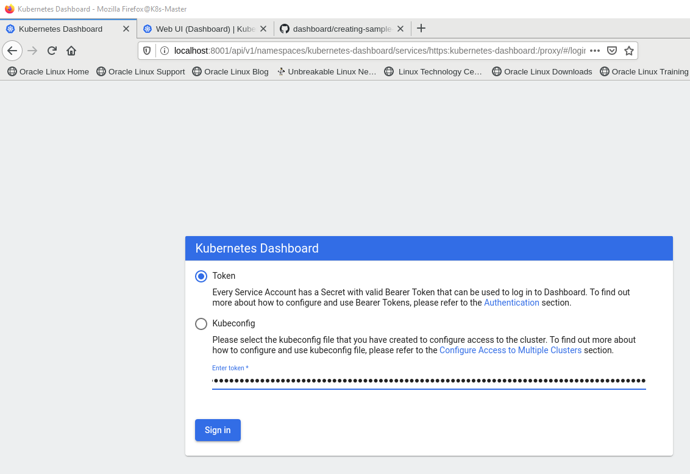

# Table of contents <!-- omit in toc -->

- [Introduction](#introduction)
- [Environment](#environment)
- [Installation](#installation)
  - [General utilities](#general-utilities)
  - [Network setup](#network-setup)
  - [Disabling selinux](#disabling-selinux)
  - [Disabling swap](#disabling-swap)
  - [Disabling firewall](#disabling-firewall)
  - [Installing the container runtime](#installing-the-container-runtime)
  - [Setting the cgroup driver](#setting-the-cgroup-driver)
  - [Installing kubeadm, kubelet and kubectl](#installing-kubeadm-kubelet-and-kubectl)
  - [Downloading control plane images](#downloading-control-plane-images)
  - [Installing the control plane](#installing-the-control-plane)
  - [Temporarily enabling kubectl](#temporarily-enabling-kubectl)
  - [Creating a script for joining workers](#creating-a-script-for-joining-workers)
  - [Allow vagrant the administration](#allow-vagrant-the-administration)
  - [Install the pod network](#install-the-pod-network)
- [Debugging](#debugging)
  - [General Procedure](#general-procedure)
  - [Containers and Pods](#containers-and-pods)
    - [CRI-O](#cri-o)
    - [Containerd](#containerd)
    - [Docker](#docker)
    - [Podman](#podman)
  - [Kubeconfig](#kubeconfig)
- [Applications](#applications)
  - [Dashboard](#dashboard)
- [Kubectl](#kubectl)
- [Configuration files](#configuration-files)
  - [CRI-O configuration files](#cri-o-configuration-files)
  - [kubelet configuration files](#kubelet-configuration-files)
  - [Network configuration files](#network-configuration-files)

## Introduction

This project is about creating kubernetes via vagrant multi machine creation. Compared to most other setups this one is different in the following points:

- It uses CRI-O instead of Docker
- It uses a config file for kubeadm instead of commandline parameters
- It uses shell scripts for provisioning instead of an iac file like an ansible playbook

All steps that need to be done are clearly separated into own functions to give a better overview. Additionally I will try to give a description for each step if further information is necessary.

:warning: While the Vagrantfile and the provisioning scripts are in a working state this documentation isn't. So please be prepared that some informations might be invalid or outdated. If in doubt prefer the commands from the shell scripts over the documentation.

References:

- <https://kubernetes.io/blog/2019/03/15/kubernetes-setup-using-ansible-and-vagrant/>

## Environment

The following environment is used to install kubernetes:

|Component          |Version
|-------------------|-------
|Operating System   |Oracle Enterprise Linux 8
|Kubernetes         |1.20.4
|Container Runtime  |CRI-O 1.13.0

## Installation

The complete kubernetes installation can be done by just running `vagrant up` in the repository root directory. However for debugging purposes and for curiosity there are also additional options.

The two VMs that make up the cluster can be created independently. Additionaly the provisioning of the VM can also be run independently from it's creation with vagrant. The following commands can be used for this.

Master Commands

- Create master: `vagrant up K8s-Master`
- Provision existing master: `vagrant up K8s-Master --provision`
- SSH to master: `vagrant ssh K8s-Master`

Worker Commands

- Create worker: `vagrant up K8s-Worker1`
- Provision existing worker: `vagrant up K8s-Worker1 --provision`
- SSH to worker: `vagrant ssh K8s-Worker1`
- Join Worker: `sudo su -c '/vagrant/join_worker.sh'`

In contrast to the kubernetes documentation I will have all informations in on document and in the necessary sequence. Installing kubernetes can therefore also be done by doing each step manually.

:bulb: If something goes wrong reset the cluster with `sudo kubeadm reset --force` and try it again. For further informations about cleaning up a failed installation see: <https://kubernetes.io/docs/setup/production-environment/tools/kubeadm/create-cluster-kubeadm/#tear-down>

### General utilities

On each node I installed the following packages:

- Vim: For showing logfiles and editing system settings
- Iproute-tc: ?

### Network setup

For some unknown reason the `br_netfilter` module wasn't loaded after a system reboot.
Because of this there was no  `/proc/sys/net/bridge/bridge-nf-call-iptables` file which is needed for running the worker.  


This could be fixed by forcing the automatic loading of the module through an entry in the `modules-load.d` directory:

```bash
cat << EOF | sudo tee /etc/modules-load.d/br_netfilter.conf
# Load br_netfilter.ko at boot
br_netfilter
EOF
```

Commands that can be used to check the br_netfilter settings:

1. Make sure that at least one config file contains the bridge-nf-call-iptables setting:
   - `grep -r "bridge-nf-call-iptables" /usr/lib/sysctl.d`
   - `grep -r "bridge-nf-call-iptables" /etc/sysctl.d/`
1. Check if br_netfilter is loaded: `lsmod | grep br_netfilter`
1. Load br_netfilter: `sudo modprobe br_netfilter`
1. Load overlay: `sudo modprobe overlay`
1. Apply configuration: `sudo sysctl --system`
1. Check if bridge-nf-call-iptables exists: `ll /proc/sys/net/bridge/`

References:

- <https://kubernetes.io/docs/setup/production-environment/container-runtimes/#cri-o>
- <https://kubernetes.io/docs/setup/production-environment/tools/kubeadm/install-kubeadm/#letting-iptables-see-bridged-traffic>

### Disabling selinux

SELinux might prevent some network connections if not configured carefully. Because this setup is just for a test cluster it was easier to disable SELinux than taking care of a correct configuration.

References:

- <https://kubernetes.io/docs/setup/production-environment/tools/kubeadm/troubleshooting-kubeadm/#coredns-pods-have-crashloopbackoff-or-error-state>

### Disabling swap

Disabling swap can be done with `sudo swapoff -a`. To make sure that swap stays off it needed to be disabled in the filesystem table with `sudo sed --in-place 's|^/dev/mapper/vg_main-lv_swap|#/dev/mapper/vg_main-lv_swap|' /etc/fstab`

References:

- <https://serverfault.com/questions/881517/why-disable-swap-on-kubernetes>

### Disabling firewall

The firewall might block some network connections if not configured carefully. Because this setup is just for a test cluster it was easier to disable the firewall than taking care of a correct configuration.

### Installing the container runtime

References:

- <https://kubernetes.io/docs/setup/production-environment/container-runtimes/#cri-o>

### Setting the cgroup driver

In general only one cgroup driver should be used for the whole system.

> A single cgroup manager simplifies the view of what resources are being allocated and will by default have a more consistent view of the available and in-use resources. When there are two cgroup managers on a system, you end up with two views of those resources. In the field, people have reported cases where nodes that are configured to use cgroupfs for the kubelet and Docker, but systemd for the rest of the processes, become unstable under resource pressure.
>
> Changing the settings such that your container runtime and kubelet use systemd as the cgroup driver stabilized the system.
>
> <cite>-- Kubernets Dockumentation  
> https://kubernetes.io/docs/setup/production-environment/container-runtimes/#cgroup-drivers
> </cite>

Additionally the cgroup driver that is used by the kubelet needs to match the cgroup driver that is used by the container technology.

1. Detect the CRI-O cgroup driver:
   - Statically: `cat /etc/crio/crio.conf | grep cgroup_manager`
   - Runtime Detection: `sudo curl -s --unix-socket /var/run/crio/crio.sock http://localhost/info | jq`  
    
1. Detect the kubelet cgroup driver: `cat /var/lib/kubelet/config.yaml |grep cgroupDriver`  


In our setup CRI-O uses systemd as cgroup driver while the kubelet uses cgroupfs. To get out of this incompatible situation we need to tell `kubeadm init` that systemd should be used.

We do this by adding the following to the configuration file for `kubeadm init`

```xml
apiVersion: kubelet.config.k8s.io/v1beta1
kind: KubeletConfiguration
cgroupDriver: systemd
```

References:

- <https://kubernetes.io/docs/setup/production-environment/container-runtimes/#cgroup-drivers>
- <https://kubernetes.io/docs/setup/production-environment/tools/kubeadm/install-kubeadm/#configure-cgroup-driver-used-by-kubelet-on-control-plane-node>
- <https://github.com/cri-o/cri-o/issues/2414>

### Installing kubeadm, kubelet and kubectl

### Downloading control plane images

### Installing the control plane

Depending on the configuration several parameters might need to be given to kubeadm init. However some parameters are only available via configuration file.

> The preferred way to configure kubeadm is to pass an YAML configuration file with the `--config` option. Some of the configuration options defined in the kubeadm config file are also available as command line flags, but only the most common/simple use case are supported with this approach.
>
> <cite>-- Kubeadm documentation  
> https://pkg.go.dev/k8s.io/kubernetes@v1.20.4/cmd/kubeadm/app/apis/kubeadm/v1beta2
> </cite>

1. Open kubeadm api site with the version overview: <https://pkg.go.dev/k8s.io/kubernetes/cmd/kubeadm/app/apis/kubeadm?tab=versions>
1. Click on the version you use which is in my example `v1.20.4`  
1. 
1. Now on the menu above click on **kubeadm**  

1. Expand the app directory  

1. You will see that there are two version of the configuration file format namely v1beta1 and v1beta2. Because we will use the newest version we click on v1beta2  

1. You will now have a document with the description of the configuration file and a full example.
1. Read out the configuration that you need from the example which is in our case:

  ```yml
  apiVersion: kubeadm.k8s.io/v1beta2
  kind: InitConfiguration
  localAPIEndpoint:
    advertiseAddress: 10.0.2.15
    bindPort: 6443
  ```

You can also retrieve the default configuration by executing: `kubeadm config print init-defaults`

### Temporarily enabling kubectl

Per default the shell script is run as the root user. because we want to use the vagrant user for the kubernetes administration we set the environment variable `export KUBECONFIG=/etc/kubernetes/admin.conf` to the correct configuration for kubectl. This way we can use kubectl temporarily as root user.

### Creating a script for joining workers

My first attemp was to log the output from kubeadm init and then parsing out the join command with sed.

1. Saving output of kubeadm init: `sudo kubeadm init --config=/vagrant/k8s_config_flannel.yaml | tee k8s_setup.log`
1. Parsing out the join command:

    ```bash
    # Save the needed join info into a textfile
    # -r, --regexp-extended: use extended regular expressions in the script
    # -n, --quiet, --silent: suppress automatic printing of pattern space
    # The text in k8s_setup.log contains forward slashes and because of this we need a different delimiter for sed
    # We use @ instead of /
    sed -rn 's@(kubeadm join \S* --token .*)@\1@p;s@.*(--discovery-token-ca-cert-hash \S*)@\1@p' k8s_setup.log > join_worker.txt
    ```

While the above sed command works as expected on a terminal it doesn't do this for some unknown reason when it is executed by vagrant. Because of this I created the token manually
and saved the output of the command in a textfile. This works as expected.

I used the vagrant folder as output folder because the worker nodes also have access to this directory.
During provisioning of the vm I run the script with `sudo su -c '/vagrant/join_worker.sh'` and that joins the worker node to the cluster.  


References:

- <https://stackoverflow.com/questions/15067796/grep-and-print-back-reference>
- <https://www.gnu.org/software/sed/manual/sed.html#Multiple-commands-syntax>
- <https://kubernetes.io/blog/2019/03/15/kubernetes-setup-using-ansible-and-vagrant/>

### Allow vagrant the administration

### Install the pod network

We do not have internet access on our test machines and therefore we apply the pod network addon from a local path instead of retrieving it from the internet.

- Deploying from internet: `sudo kubectl apply -f https://github.com/coreos/flannel/raw/master/Documentation/kube-flannel.yml`
- Deploying from local: `cat /vagrant/kube-flannel.yml | kubectl create -f -`  


The `kube-flannel.yml` can be read here: <https://github.com/coreos/flannel/blob/master/Documentation/kube-flannel.yml>

References:

- <https://stackoverflow.com/questions/48984659/understanding-kubeadm-init-command-for-flannel>
- <https://kubernetes.io/docs/setup/production-environment/tools/kubeadm/troubleshooting-kubeadm/#default-nic-when-using-flannel-as-the-pod-network-in-vagrant>

## Debugging

Debugging in Kubernetes is a huge field and therefore I try to categorize it to be able to give some helpful hints in case someone gets stucked.

Let's start with some general commands to retrieve cluster informations:

|Command |Purpose |
|--------|--------|
|`kubectl get pods --all-namespaces` |Get a list with all pods|
|`kubectl api-resources` |Retrieve a list with all sources that can be requested for informations
|`kubectl cluster-info` |Retrieve general informations about the cluster  
|`kubectl get nodes` |Show all nodes
|`kubectl version --client` |Get client version

### General Procedure

1. Make sure that the services for the container runtime and the kubelet are running  

1. Make sure that you use the right user. If you have a kubectl configuration file for the vagrant user but not for the root user the follwing command will fail even if your cluster is working: `sudo kubectl get nodes`

1. Make sure that kubectl uses the right configuration file. See [Kubeconfig](#kubeconfig)
1. Execute `kubectl get nodes` to check if your nodes are running. If they are not running check the status of your containers and pods. See [Debug Containers and Pods](#debug-containers-and-pods)  

1. Execute `kubectl cluster-info` to check if control plane and dns is running

References:

- <https://kubernetes.io/docs/tasks/debug-application-cluster/debug-cluster/>
- <https://www.thegeekdiary.com/troubleshooting-kubectl-error-the-connection-to-the-server-x-x-x-x6443-was-refused-did-you-specify-the-right-host-or-port/>
- <https://kubernetes.io/docs/setup/production-environment/tools/kubeadm/troubleshooting-kubeadm/>

### Containers and Pods

Debugging the containers and pods depends on your container technology.

#### CRI-O

Use crictl to see if containers, pods are running. Here are some general commands to start debugging

- View crictl configuration: `cat /etc/crictl.yaml`
- Get crictl help: `crictl help` or `crictl <subcommand> help`
- List all pods: `crictl pods`
- List all images: `crictl images`
- List containers: `crictl ps -a`
- List running containers: `crictl ps`
- Get a containers log: `crictl logs <container_id>`

To verify your Kubernetes installation do the following:

- Make sure that all pods are running: `sudo crictl pods`  

- Make sure that the kube-apiserver container is running: `sudo crictl ps | grep kube-apiserver`  

- Make sure that the kube-scheduler is running: `sudo crictl ps | grep kube-scheduler`  

- Make sure that the kube-controller-manager is running: `sudo crictl ps | grep kube-controller-manager`  


If one of the containers is not running and you are using systemd you should check their log messages with journalctl: `sudo journalctl -f`

References:

- <https://kubernetes.io/docs/tasks/debug-application-cluster/crictl/>
- <https://documentation.suse.com/de-de/sled/15-SP1/html/SLED-all/cha-journalctl.html>

#### Containerd

#### Docker

#### Podman

### Kubeconfig

The command kubectl uses one ore more config files to get it's informations. Which config file is taken is determined by the following logic:

1. Parameter `--kubeconfig`
1. Environment Variable `KUBECONFIG`
1. Config file in `$HOME/.kube/config`

To see the configuration that is used by kubectl use: `kubectl config view`

References:

- <https://ahmet.im/blog/mastering-kubeconfig/>

## Applications

The first application that we install will be the kubernetes dashboard to get an overview about our cluster.

### Dashboard

1. Windows preparations:
    1. Install vcxsrv to view firefox: `choco install vcxsrv`
    1. Start vcxsrv with the XLaunch Utility and accept all default settings
1. Login to K8s-Master
1. Install dependencies that are needed for running firefox:
   - Mesa: `yum install mesa-libGL`
   - Xauth: `sudo yum install xorg-x11-xauth`
1. Install Firefox to be able to view the dashboard: `yum install firefox`
1. Create a service account:

    ``` bash
    cat <<EOF | kubectl apply -f -
    apiVersion: v1
    kind: ServiceAccount
    metadata:
    name: admin-user
    namespace: kubernetes-dashboard
    EOF
    ```

    

1. Create a cluster role binding for the service account:

    ```bash
    cat <<EOF | kubectl apply -f -
    apiVersion: rbac.authorization.k8s.io/v1
    kind: ClusterRoleBinding
    metadata:
    name: admin-user
    roleRef:
    apiGroup: rbac.authorization.k8s.io
    kind: ClusterRole
    name: cluster-admin
    subjects:
    - kind: ServiceAccount
    name: admin-user
    namespace: kubernetes-dashboard
    EOF
    ```

    

1. Get a bearer token: `kubectl -n kubernetes-dashboard get secret $(kubectl -n kubernetes-dashboard get sa/admin-user -o jsonpath="{.secrets[0].name}") -o go-template="{{.data.token | base64decode}}"`
1. Copy the bearer token. Maybe save it somewhere for later use
1. Deploy the Dashboard UI: `kubectl apply -f https://raw.githubusercontent.com/kubernetes/dashboard/v2.0.0/aio/deploy/recommended.yaml`
1. Make it temporarily available via proxy: `kubectl proxy`
1. Open another ssh seesion to K8s-Master with X11 forwarding enabled. In putty you can do this with the `-X` parameter
1. Open firefox: `firefox&`
1. View the dashboard: <http://localhost:8001/api/v1/namespaces/kubernetes-dashboard/services/https:kubernetes-dashboard:/proxy/>
1. Copy the token into the field **Enter token \*** and click on **Sign in**  

1. You will now see the dashboard  


References:

- <https://kubernetes.io/docs/tasks/access-application-cluster/web-ui-dashboard/>
- <https://github.com/kubernetes/dashboard/blob/master/docs/user/access-control/creating-sample-user.md>

## Kubectl

Use `kubectl apply -f <directory>`. This looks for Kubernetes configuration in all `.yaml`, `.yml`, and `.json` files in `<directory>` and passes it to apply.

References:

- <https://kubernetes.io/docs/concepts/configuration/overview/>

## Configuration files

Because there is a huge mass of config files I decided to provide an overview by listing the config files and explaining their purpose

### CRI-O configuration files

| Config file | Purpose |
|-------------|---------|
|/etc/crictl.yaml |
|/etc/crio/crio.conf |

### kubelet configuration files

| Config file | Purpose |
|-------------|---------|
|/etc/systemd/system/multi-user.target.wants/kubelet.service |SystemD service file
|/usr/lib/systemd/system/kubelet.service.d/10-kubeadm.conf |Kubelet config
|/etc/kubernetes/bootstrap-kubelet.conf |bootstrap-kubeconfig
|/etc/kubernetes/kubelet.conf |kubeconfig for kubelet
|/var/lib/kubelet/config.yaml |kubelet config

### Network configuration files

| Config file | Purpose |
|-------------|---------|
|/etc/sysconfig/network |Top level networking configuration
|/etc/sysconfig/network-scripts/ifcfg-eth0 |Network configuration for the eth0 adapter
|/etc/hosts |Information for local name resolution
|/etc/resolv.conf |Configure the location of the DNS servers to be used for name resolution
|/etc/sysconfig/network-scripts |Directory that contains a number of network related scripts and commands

References:

- <https://oracle-base.com/articles/linux/linux-network-configuration>